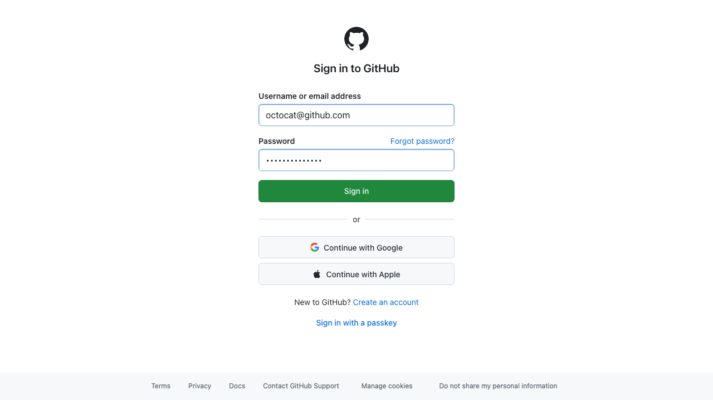

# Webpilot

**The web, through the eyes of a machine.**

[](https://www.npmjs.com/package/webpilot)
[](https://opensource.org/licenses/MIT)

A semantic terminal browser that renders web pages as structured, numbered, interactive text. Built for **LLM agents** (via [MCP](https://modelcontextprotocol.io)), **CLI-native developers**, and **automation pipelines**.

> **Key insight:** LLMs don't need to *see* a website — they need to *understand* it. Webpilot uses the accessibility tree (the same structure screen readers use) to represent any website as numbered elements that both humans and machines can interact with.

```
$ webpilot https://github.com

┌──────────────────────────────────────────────────────────────┐
  GitHub: Let's build from here
  https://github.com
└──────────────────────────────────────────────────────────────┘

  [1] › link         Sign in
  [2] › link         Sign up
  [3] ⌕ searchbox    Search GitHub
  [4] # h1           Build and ship software on a single platform
  [5] _ textbox      Enter your email address
  [6] ◆ button        Sign up for GitHub 

~ › click 1

  Navigated: github.com -> github.com/login

  [1] # h1           Sign in to GitHub
  [2] _ textbox      Username or email address
  [3] _ textbox      Password
  [4] ◆ button        Sign in 
  [5] › link         Forgot password?
  [6] › link         Create an account

~ › type 2 octocat@github.com
~ › type 3 ••••••••

~ › ss github-login.png

  Screenshot saved to github-login.png
```

The screenshot webpilot saves:



## Why Webpilot?

| | Browsh | Lynx | Carbonyl | **Webpilot** |
|---|---|---|---|---|
| JavaScript support | Yes | No | Yes | **Yes** |
| SPAs (React, Next.js, Vue) | Yes | No | Yes | **Yes** |
| LLM-parseable output | No | No | No | **Yes** |
| MCP server for AI agents | No | No | No | **Yes** |
| Element interaction by ID | No | No | No | **Yes** |
| State diffs | No | No | No | **Yes** |
| Semantic (a11y tree) | No | Partial | No | **Yes** |
| No pixels, no rendering | No | Yes | No | **Yes** |
| Zero cost (runs locally) | Yes | Yes | Yes | **Yes** |

## Install

```bash
npm install -g webpilot
npx playwright install chromium   # one-time browser setup
```

## Quick Start

```bash
# Interactive REPL
webpilot https://google.com

# JSON output for LLM agents
webpilot --agent https://google.com

# Pipe mode for scripting
echo 'goto https://example.com
extract --links' | webpilot --pipe

# Shorthand URLs
webpilot :3000              # → http://localhost:3000
webpilot google.com         # → https://google.com
```

## MCP Server (for Claude, ChatGPT, etc.)

Webpilot ships as an **MCP server** — any LLM agent that supports the [Model Context Protocol](https://modelcontextprotocol.io) can browse the web through it.

### Setup with Claude Desktop

Add to your `claude_desktop_config.json`:

```json
{
  "mcpServers": {
    "webpilot": {
      "command": "npx",
      "args": ["-y", "webpilot", "--mcp"]
    }
  }
}
```

### Setup with VS Code / Copilot

Add to your `.vscode/mcp.json`:

```json
{
  "servers": {
    "webpilot": {
      "command": "npx",
      "args": ["-y", "webpilot", "--mcp"]
    }
  }
}
```

### Available MCP Tools

| Tool | Description |
|------|-------------|
| `web_navigate` | Open a URL and get page state |
| `web_snapshot` | Get current page as numbered elements |
| `web_click` | Click element by `[n]` ID |
| `web_type` | Type into input/textarea by `[n]` ID |
| `web_select` | Select dropdown option |
| `web_scroll` | Scroll up/down/top/bottom |
| `web_back` | Go back in history |
| `web_extract` | Extract text, links, tables, forms, or metadata |
| `web_eval` | Execute JavaScript in page context |
| `web_screenshot` | Capture page as PNG image |
| `web_tabs` | List open tabs |
| `web_newtab` | Open new tab |
| `web_close` | Close browser session |

### Example Agent Interaction

```
Agent: web_navigate("https://news.ycombinator.com")
→ 280 elements: [1] link "Hacker News", [2] link "new", [3] link "past" ...

Agent: web_click(5)
→ Navigated to article page, 42 elements

Agent: web_extract({ type: "text" })
→ Full article text extracted

Agent: web_back()
→ Back to Hacker News front page
```

## Commands Reference

| Command | Description |
|---------|-------------|
| `goto <url>` | Navigate to URL |
| `click [n]` | Click element by ID |
| `type [n] "text"` | Type into form field |
| `select [n] "option"` | Select dropdown option |
| `check [n]` / `hover [n]` | Toggle checkbox / hover |
| `press <key>` | Press keyboard key (Enter, Tab, etc.) |
| `back` / `forward` | Browser history |
| `refresh` | Reload current page |
| `scroll down\|up\|top\|bottom` | Scroll the page |
| `find "text"` | Search for text in elements |
| `show` | Re-display current page state |
| `extract --text\|--links\|--tables\|--forms\|--meta` | Extract structured content |
| `eval "js"` | Execute JavaScript |
| `screenshot [path]` | Save screenshot |
| `source` | View page HTML |
| `tabs` / `tab [n]` / `newtab` / `closetab` | Tab management |
| `help` | Show all commands |

## Three Output Modes

- **Human** (default) — Colored, formatted for terminal reading
- **Agent** (`--agent`) — JSON structured output for LLM consumption
- **Pipe** (auto-detected) — Plain text for `grep`, `awk`, scripting

## How It Works

```
Website → Playwright (headless Chromium) → CDP Accessibility Tree → Numbered Elements → You
```

1. **Playwright** launches headless Chromium — full JS, cookies, SPAs, everything works
2. The **accessibility tree** is extracted via Chrome DevTools Protocol — semantic structure, not pixels
3. Elements get **numbered IDs** — `[1]`, `[2]`, `[3]`... for easy targeting
4. After each action, a **state diff** shows what changed, not the entire page
5. You interact with simple commands: `click [3]`, `type [5] "hello"`

## Works With Everything

- `localhost:3000` — your dev server
- Public websites — Google, GitHub, HN, anything
- React / Next.js / Vue / Angular / Svelte — full JS execution
- SPAs with client-side routing
- Sites behind login — cookies persist in session
- Dynamic content — JS runs before each snapshot
- Forms, dropdowns, checkboxes — full interaction
- Multi-tab browsing

## Use Cases

- **LLM agents browsing the web** — Claude/ChatGPT navigate, fill forms, extract data via MCP
- **E2E testing in CI** — pipe commands, assert output, no flaky selectors
- **Web scraping** — extract links, tables, text from any JS-rendered page
- **Accessibility auditing** — see exactly what the a11y tree exposes
- **SSH/headless environments** — browse from any terminal, no GUI needed

## Development

```bash
git clone https://github.com/luckysolanki902/webpilot.git
cd webpilot
npm install
npx playwright install chromium
npm run build    # → dist/index.js
npm run dev      # Watch mode
```

## License

MIT
